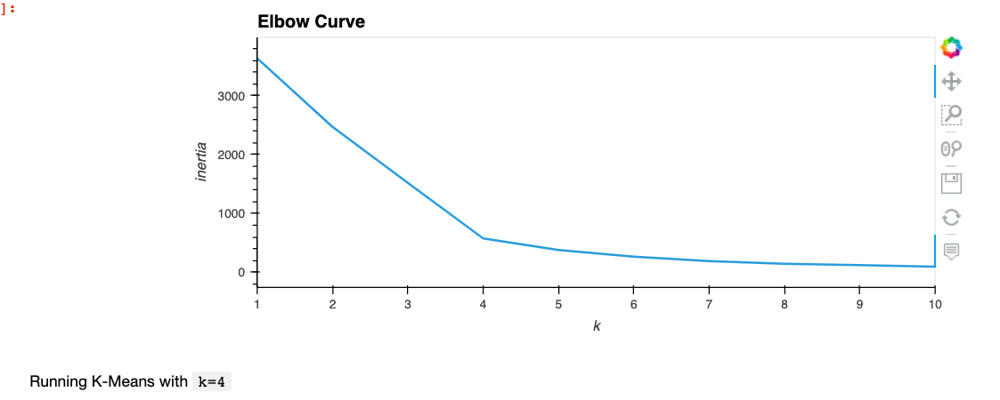
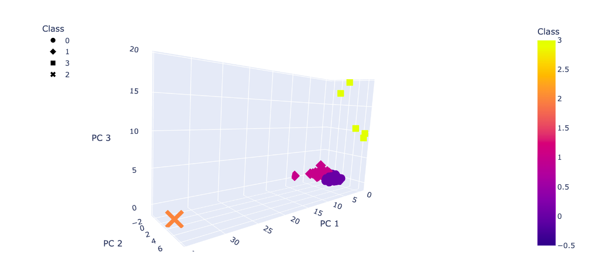
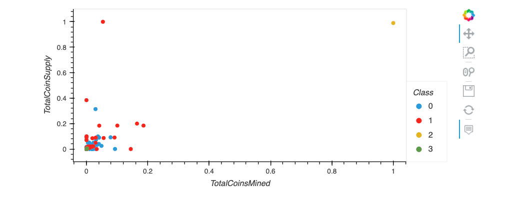

# **Module18-Cryptocurrencies**
# **Unsupervised Machine Learning**

### The objective of this analysis is to use unsupervised machine learning to analyze a database of cryptocurrencies and create a report that includes the types of cryptocurrencies on the trading market and a classification system to group the currencies for clients' investment portfolios.

### The following methods are used for the analysis:

### - Preprocessing the Data for PCA
### - Reducing Data Dimensions Using PCA (Principal Component Analysis)
### - Clustering Crytocurrencies Using K-Means
### - Visualizing Cryptocurrencies Results with 2D and 3D scatter plots

## **Results**

### After the preprocessing and cleaning phase we have a total of 532 tradable cryptocurrencies.

## **Clustering Cryptocurrencies using K-Means - Elbow Curve**

### The best k value appears to be 4 so we would conclude on an output of 4 clusters to categorize the crytocurrencies.

## **Visualizing Cryptocurrencies Results**

### **3D-Scatter with Clusters**

### This 3-D scatter plot was obtained using the PCA algorithm to reduce the crytocurrencies dimensions to three principal components.

### **2D-Scatter plot with TotalCoinMined vs TotalCoinSupply**

